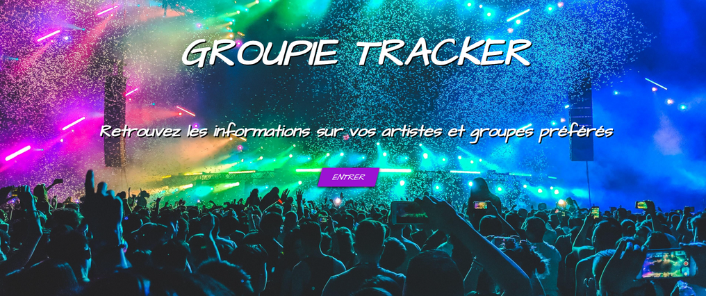
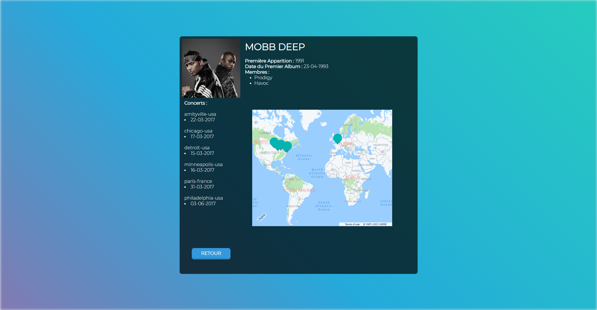

# Groupie Tracker

## Objectives :

Groupie Tracker consists on using a given API and manipulating the data contained inside of it to create a website,displaying its information.

The whole project refers to recover data of the artists, like for example their name, the place where they were born and much much more.

Our goal was to use this information to help the user find what he wanted to know about some of his favorite artists/groups !

## How does it work ?

Our website is pretty simple to use, to open it you need to write go run main.go in your command prompt then go to your web browser and go on localhost:8080

You'll be brought to this website :

You will only need to click on the **"Entrer"** button and then you're done !

From here on, when you click on one of the image displayed on the page, you can search for every information about the artist/group that you need to know things about.

## Functionnalities :
You can find different informations about the artists you love: their name, the year of their debut, the date of their first published album, and even their members(if they are in a group).

You can also know the exact locations of their most recent concerts showed on a map (based on the data we got).

You can also filter the artists/groups by:
- The year of their debut;
- The date of their first published album;
- The number of members;
- The location of their concerts.

## Sources :

Html Part : https://www.w3schools.com/html/

Json Part : https://tutorialedge.net/golang/parsing-json-with-golang/

General idea : https://groupie-tracker-lucas-pierre.herokuapp.com/

Concert geolocalisation API : https://developer.here.com/
